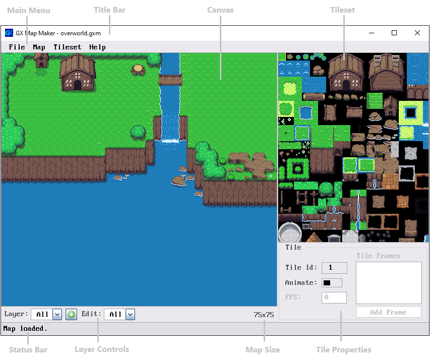
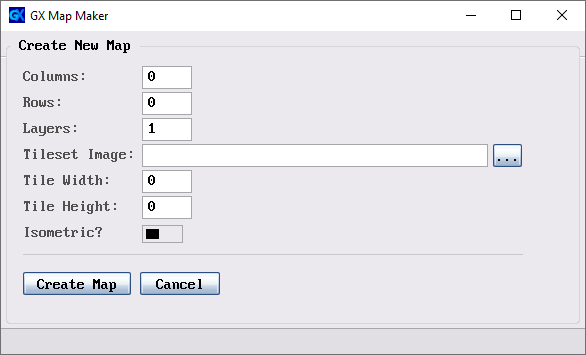
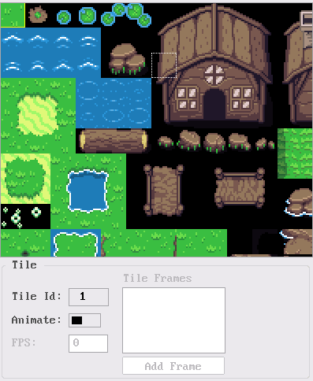
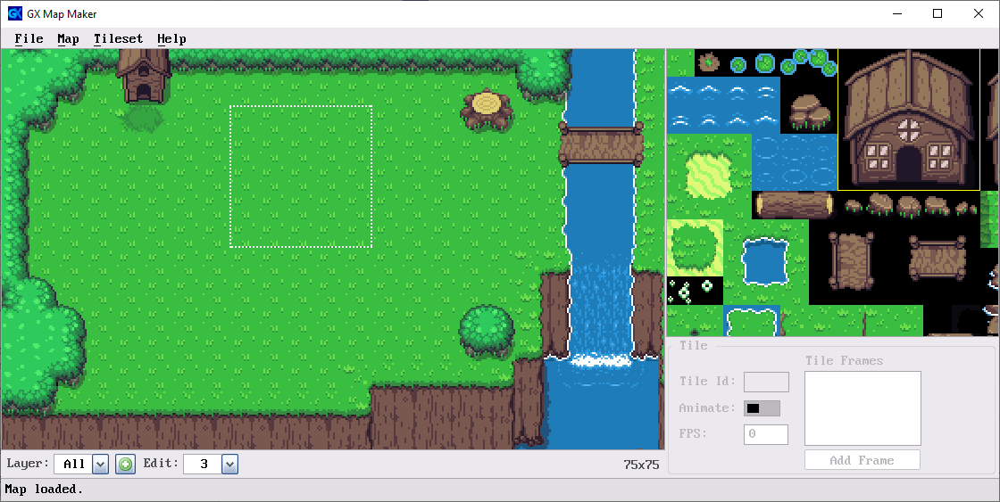
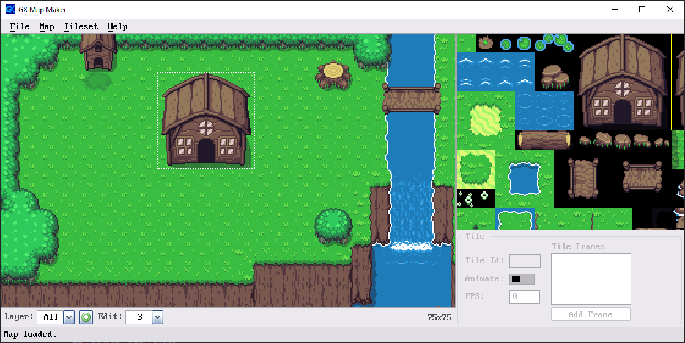
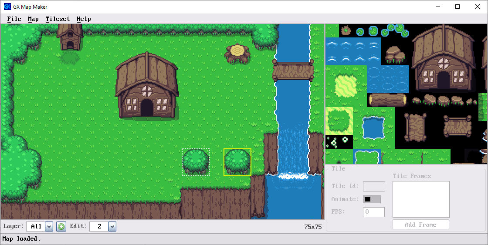

# GX Map Maker

The **GX Map Maker** allows game makers to create tile-based maps that can be imported for use in [GX](https://github.com/boxgaming/gx) games from [boxgaming](https://github.com/boxgaming).

---

## Background

The GX Map Maker was originally built in [QB64](https://github.com/QB64Team/qb64) using both the [GX](https://github.com/boxgaming/gx) engine and the [InForm](https://github.com/FellippeHeitor/InForm) GUI framework.

After the split in the QB64 community and subsequent development, the original [InForm](https://github.com/FellippeHeitor/InForm) application no longer builds in the [QB64-PE](https://www.qb64phoenix.com) fork. This is because [InForm](https://github.com/FellippeHeitor/InForm) relied on undocumented [QB64](https://github.com/QB64Team/qb64) features that are no longer supported. The [QB64-PE](https://www.qb64phoenix.com) runtime library has since evolved, removing the undocumented hacks that InForm depended on.

As a result, this port of the GX Map Maker represents an effort to transition toward [InForm-PE](https://github.com/a740g/InForm-PE) and [QB64PE](https://www.qb64phoenix.com).

The latest version of the GX Map Maker has been ported to a QBJS-only online implementation and can be accessed here:  
👉 [https://boxgaming.github.io/gx-mapmaker](https://boxgaming.github.io/gx-mapmaker)

All future versions of the Map Maker will be maintained at:  
👉 [https://github.com/boxgaming/gx-mapmaker](https://github.com/boxgaming/gx-mapmaker)

## Features

The GX Map Maker currently supports:

- Tiled map creation and management  
- Multiple tile layers  
- Animated tiles  
- Orthogonal and isometric tilesets

## User Interface

  

### Main Menu

The main application functions are accessible via the Main Menu.  

- The File menu provides the ability to open, save and create new maps.  
- The Map menu provides the ability to set the zoom level of the map view (Canvas) and resize the current map.  
- The Tileset menu provides the ability to set the zoom level of the tileset view and replace the current tileset image.
- The Help menu provides a quick link to view this reference as well as version information.

### Title Bar

The title bar displays the name of the currently loaded map.  If this is a new map that has not been saved, "&lt;New Map&gt;" will appear here.

### Canvas

The canvas displays the map and allows the user to make edits by placing tiles selected from the Tileset or from a selection area on the map.  The map position can be scrolled by using the WSAD or arrow keys when the Canvas has the mouse focus.

### Tileset

The tileset view displays the tileset image containing the various tiles which can be placed on the map.  One or more tiles can be selected from this list for placement on the current map layer.  The tileset view can be scrolled by using the WSAD or arrow keys when the Tileset view has the mouse focus.

### Status Bar

The status bar displays information about the last action performed.

### Layer Controls

The layer controls provide the ability to:

- Add, insert and remove layers
- Set the visibility of a selected layer
- Set the current edit layer

### Map Size

This label displays the size in tile columns and rows of the currently loaded map.

### Tile Properties

This control displays the id and animation information, if present, for the currently selected tile.

## Creating a New Map

Select the New option from the File Menu.  This will load the new map dialog.

Specify the size of the map to create by setting the total number of columns and rows of tiles.  Select a tileset image and indicate the size in pixels of each tile.  The tileset image should have all of the tile images on a single sheet with no spacing between each tile.  For example, the overworld.png tilesheet image in the samples/overworld/img directory contains a sheet of 16x16 tiles:

## Editing the Map

In order to make changes to the map, select a tile from the tileset.  The currently selected tile will be framed with a yellow outline and information about the selected tile will display in the Tile Properties:

Clicking on the map will place the selected tile at the cursor location.

Multiple tiles can be selected as a block.  Click and drag the mouse to select a block of tiles.  The map cursor will now be resized to the size of the tile selection.  

Click the map to place the selected tiles at the cursor location:

_NOTE: Multiple tile selection is not currently supported for isometric maps._

### Copy and Paste

While the GX Map Maker does not currently have a clipboard, you can copy tiles from a selection on the map.  Hold the Shift key and drag the mouse down and to the right to select the tiles you wish to copy.  A yellow border will be displayed around the block of tiles to copy.

Clicking on the map will place a copy of the selected tiles in the cursor location.

_NOTE: Map tile selections are not currently supported for isometric maps._

### Moving the View

When you have a map or tileset that is larger than the current window simply use the WSAD or arrow keys to move the area you wish to edit into view.

## Working with Layers

GX supports creating maps with multiple layers.  Each subsequent layer is rendered on top of the previous.  So, for example, if the map has three layers.  Layer one will be rendered first, followed by layer two and then finally layer three would be rendered on top of both.  This allows for "stacking" of tiles to create rich map content.

Layers are managed by the layer controls which are displayed beneath the map canvas.  The first dropdown controls the displayed layer.  When set to "All" all visible layers in the map are displayed and an add button is enabled to the right of the dropdown.  Clicking this button will add a new topmost layer to the map.

When a specific layer is selected from this dropdown, only the tiles in that layer are displayed.  Clicking the add button in this mode will insert a new layer before the selected layer.  There is also a delete button which will delete the current layer from the map.  If the hide layer checkbox is selected, the current layer will not be displayed when viewing the map in "All" mode.

### Editing Layers

The dropdown to the right of the "Edit" label restricts editing to the selected layer.  When a specific layer is selected in the Edit dropdown, changes made to the map will only affect the selected layer.  If "All" is selected for the edit layer then tiles will be placed at the next empty layer in the map for the specified position.

## Animating Tiles

_This section coming soon..._
